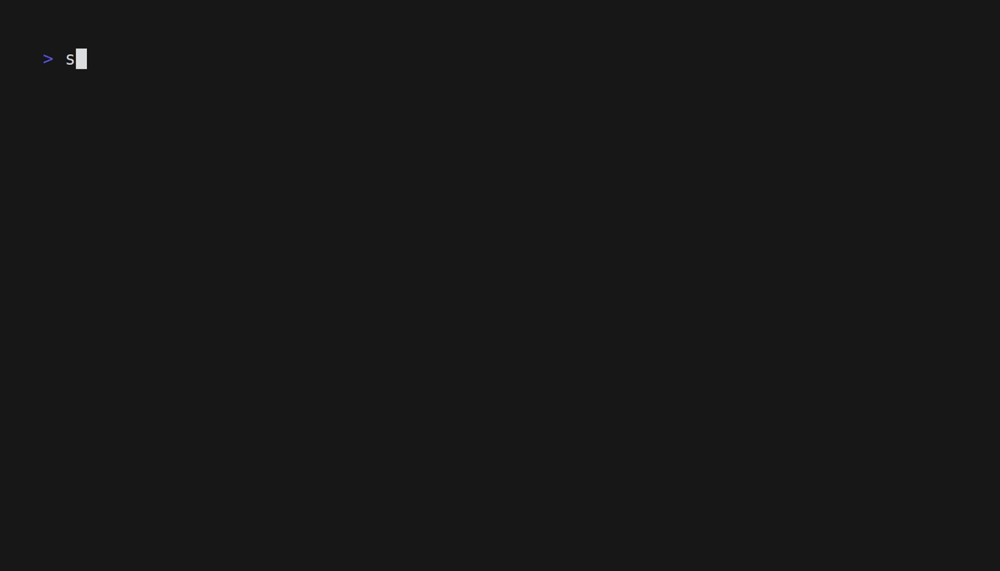
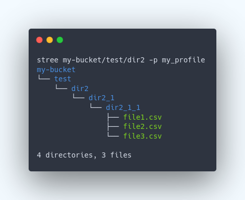
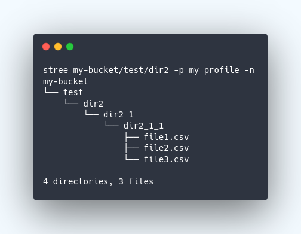

<br>

<p align="center">

</p>

<p align="center">
<a href="https://opensource.org/licenses/MIT">

</a>
<a href="https://pkg.go.dev/github.com/orangekame3/stree">

</a>
<a href="https://github.com/orangekame3/stree/actions/workflows/tagpr.yml">

</a>
<a href="https://github.com/orangekame3/stree/actions?query=workflows/MegaLinter">

</a>
</p>

<p align="center">
Directory trees of S3
</p>

<p align="center">

</p>

# Overview

`stree` is a CLI tool designed to visualize the directory tree structure of an S3 bucket.  
By inputting an S3 bucket/prefix and utilizing various flags to customize your request, you can obtain a colorized or non-colorized directory tree right in your terminal.

Whether it's for verifying the file structure, sharing the structure with your team, or any other purpose, `stree` offers an easy and convenient way to explore your S3 buckets.

# Features

- **Colorized Output**: By default, `stree` provides a colorized tree structure, making it easy to differentiate between directories and files at a glance. This feature can be turned off with the `-n` or `--no-color` flag.
- **LocalStack Support**: `stree` supports local testing with LocalStack, a fully functional local AWS cloud stack, thanks to the `--local` and `--endpoint-url` flags.
- **Custom AWS Profile and Region**: Specify the AWS profile and region with the `--profile` and `--region` flags to override the default settings as needed.
- **Switch Role Support**: Specify ARN of the role that can access the target S3 bucket with the `--switch-role` flag.
- **Ease of Installation**: Install `stree` via Go, Homebrew, or by downloading the latest compiled binaries from the GitHub releases page.

# Install

## Go

```shell
go install github.com/orangekame3/stree@latest
```

## Homebrew

```shell
brew install orangekame3/tap/stree
```

## Download

Download the latest compiled binaries and put it anywhere in your executable path.

[Download here](https://github.com/orangekame3/stree/releases)

# How to Use

> **Warning**
>Prerequisite
>You must set up the config and credentials to be used with aws cli in advance

From here on, it is assumed that the config and credentials are set as follows.

```shell
~/.aws/config
[my_profile]
region = ap-northeast-1
output = json
```

```shell
~/.aws/credentials
[my_profile]
aws_access_key_id=XXXXXXXXXXXXXXXXXXXXX
aws_secret_access_key=XXXXXXXXXXXXXXXXX
```

## Basic Commands

Specify the bucket name and profile, and execute the following command. The profile is specified with `--profile (-p)`.

```shell
stree my-bucket -p my_profile
```

You will get the following output.

```shell
my-bucket
└── test
    ├── dir1
    │   ├── dir1_1
    │   │   └── dir1_1_1
    │   │       ├── file1.csv
    │   │       └── file2.csv
    │   └── dir1_2
    │       ├── file1.csv
    │       ├── file2.csv
    │       └── file3.csv
    ├── dir2
    │   └── dir2_1
    │       └── dir2_1_1
    │           ├── file1.csv
    │           ├── file2.csv
    │           └── file3.csv
    └── dir3
        ├── file1.csv
        └── file2.csv

9 directories, 10 files
```

## Specifying Prefix

```shell
stree my-bucket/test/dir2 -p my_profile
```

The result of executing this command is as follows.

```shell
my-bucket
└── test
    └── dir2
        └── dir2_1
            └── dir2_1_1
                ├── file1.csv
                ├── file2.csv
                └── file3.csv

4 directories, 3 files
```

## Overriding Region

You can specify the region with `--region (-r)`. Use the `--region` flag to override when you want to specify a region other than the one listed in the profile.

## Usage with Localstack

It can also be used with Localstack. When using it with Localstack, the endpoint and region are set to the following by default.

```shell
endpoint = http://localhost:4566
region = us-east-1
```

Since the majority of cases are expected to use the above settings, we have added a flag for Localstack, which is `--local (-l)`.

```shell
stree my-bucket/test/dir2 -l
```

In case you need to change the endpoint and region due to special circumstances, you can override with `--region (-r)` flag and `--endpoint (-e)`.

```shell
stree my-bucket/test/dir2 -r us-east-1 -e http://localhost:4537
```

## Disable Color Output

You can disable color output with `--no-color (-n)`.

<p align="center">
With color
</p>

<p align="center">

</p>

<p align="center">
Without color
</p>

<p align="center">

</p>

# Usage

```shell
Usage:
  stree [bucket/prefix] [flags]

Flags:
  -e, --endpoint-url string   AWS endpoint URL to use (useful for local testing with LocalStack)
  -h, --help                  help for stree
  -l, --local                 Use LocalStack configuration
  -n, --no-color              Disable colorized output
  -p, --profile string        AWS profile to use (default "local")
  -r, --region string         AWS region to use (overrides the region specified in the profile)
  -s, --switch-role string    Switch to ARN of the Role that can access the target S3 bucket
  -v, --version               version for stree
```

# License

`stree` is licensed under the MIT License - see the [LICENSE](./LICENSE) file for details.

# Acknowledgments

The concept of "stree" was inspired by the pioneering work seen in [gtree](https://github.com/ddddddO/gtree). I'm grateful for the inspiration.
